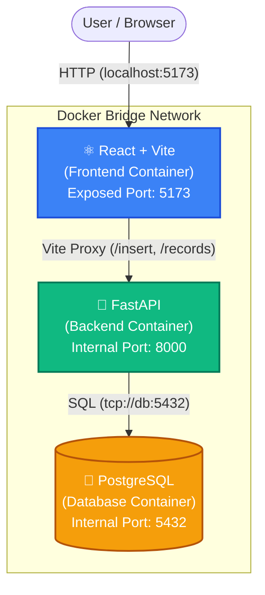

# SettleMint: Containerized 3-Tier Web Application 🚀

Welcome to the SettleMint DevOps project! This repository demonstrates a modern, fully containerized 3-tier web application using Docker, complete with local orchestration via Docker Compose and a pathway to cloud deployment on AWS ECS Fargate.

## 🏗️ Architecture Overview

Our application is built on a robust 3-tier architecture. In local development, all three tiers run in isolated Docker containers connected via a private Docker bridge network.



### 1. Frontend (Presentation Tier)
* **Tech Stack:** React, Vite, Vanilla CSS (Premium Glassmorphism UI)
* **Role:** Serves the interactive user interface to the client's browser.
* **Network Magic:** Uses Vite's built-in reverse proxy to securely forward API requests to the backend container without triggering browser CORS restrictions.

### 2. Backend (Business Logic Tier)
* **Tech Stack:** Python, FastAPI, Uvicorn
* **Role:** Handles data validation, business rules, and communicates with the database.

### 3. Database (Data Tier)
* **Tech Stack:** PostgreSQL (Alpine Linux)
* **Role:** Provides persistent storage using Docker Volumes so data isn't lost when the container stops.

---

## 🚀 How to Run Locally

You do not need to install Python, Node, or PostgreSQL on your laptop. You only need **Docker Desktop**.

1. Clone this repository.
2. Open your terminal in the root directory.
3. Run the orchestration command:
   ```bash
   docker-compose up -d
   ```
4. Open your browser and navigate to `http://localhost:5173`.

### 🔄 Live Reloading
This project is configured with advanced Docker Volume bind mounts. Any changes you make to the React CSS/JS or the Python code on your Windows host will **automatically hot-reload** inside the running Linux containers!

---

## 📚 The Ultimate Docker Guide

As part of this project, we wrote a massive, 1,400+ line comprehensive guide to mastering Docker. If you want to understand *why* this works under the hood, read the guide!

👉 **[Read the Full Docker Guide Here (DOCKER_GUIDE.md)](./DOCKER_GUIDE.md)**

**What's inside the guide:**
- Virtualization vs Containerization
- Deep dives into Images, Containers, Volumes, and Networks
- Line-by-line breakdowns of our custom `Dockerfile`s
- How to fix native Linux-binding errors on Windows volume mounts
- Full CLI command cheat sheet

---

## ☁️ AWS Cloud Deployment (In Progress)

We are currently in the process of migrating this exact architecture from our local Docker Engine to AWS. 

**Cloud Architecture Roadmap:**
1. **AWS ECR (Elastic Container Registry):** Pushing our local Docker images to the cloud. ✅
2. **AWS RDS (Relational Database Service):** Replacing our local DB container with a managed PostgreSQL server for production safety. ✅
3. **AWS Security Groups:** Creating networking rules to allow backend-to-database communication. (In Progress)
4. **AWS ECS Fargate:** Running our frontend and backend Docker containers in serverless cloud environments.
