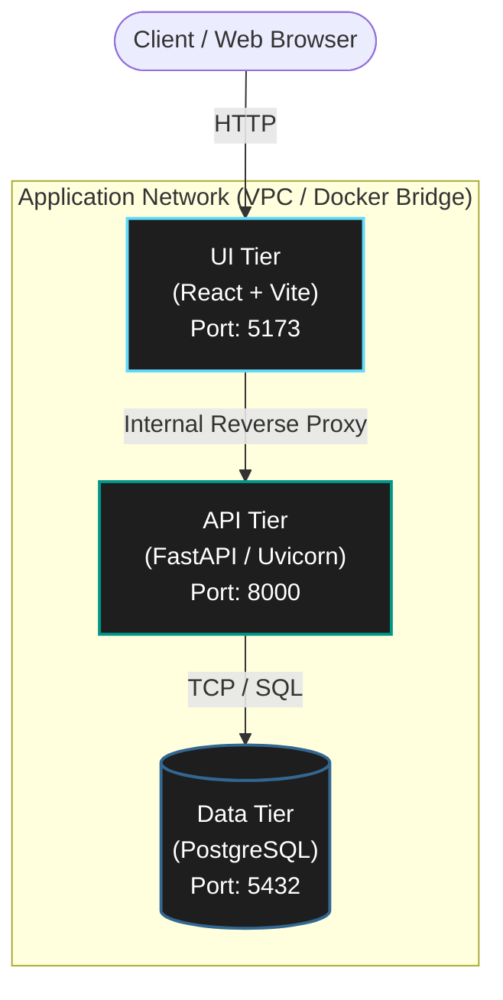

# SettleMint: Containerized 3-Tier Architecture 🚀


A production-ready, fully containerized 3-tier web application designed to demonstrate robust DevOps principles, manual container orchestration, and seamless transition from local development to a serverless AWS infrastructure.

---

## 🏗️ System Architecture

The application implements a strict separation of concerns across presentation, business logic, and data persistence tiers.



### Technical Stack
* **Frontend:** React 18, Vite, Custom CSS (Glassmorphism design system)
* **Backend:** Python 3.12, FastAPI, Uvicorn, SQLAlchemy
* **Database:** PostgreSQL 16 (Alpine)
* **Infrastructure:** Docker, AWS ECS (Fargate), AWS RDS, AWS ECR, AWS Cloud Map

---

## 💻 Local Development Environment

To enforce a deeper understanding of container networking and lifecycle management, this repository explicitly avoids `docker-compose`. All environments are orchestrated using raw Docker CLI commands via custom bridge networks.

### Prerequisites
* Docker Engine / Docker Desktop
* Git

### Manual Orchestration
To deploy the application locally, execute the following container lifecycle commands:

**1. Initialize the Network Boundary**
```bash
docker network create manual-devops-net
```

**2. Provision the Data Tier**
```bash
docker run -d --name db --network manual-devops-net \
  -e POSTGRES_USER=user \
  -e POSTGRES_PASSWORD=password \
  -e POSTGRES_DB=appdb \
  -v postgres_data:/var/lib/postgresql/data \
  -p 5433:5432 postgres:16-alpine
```

**3. Deploy the API Tier**
```bash
docker run -d --name backend \
  --network-alias backend.local \
  --network manual-devops-net \
  -e DATABASE_URL=postgresql://user:password@db:5432/appdb \
  -p 8000:8000 docker-lab-backend
```

**4. Deploy the UI Tier (with Hot-Reloading)**
```bash
docker run -d --name frontend --network manual-devops-net \
  -v ${PWD}/frontend:/app \
  -p 5173:5173 docker-lab-frontend
```

---

## ☁️ AWS Cloud Infrastructure

The application is architected for a serverless cloud deployment using the AWS ecosystem, completely mirroring the local manual orchestration structure.

* **Compute:** AWS ECS running on AWS Fargate (Serverless container execution).
* **Registry:** Images are securely hosted in Amazon ECR.
* **Database:** Fully managed Amazon RDS PostgreSQL instance to ensure data durability and automated backups.
* **Service Discovery:** AWS Cloud Map provides internal DNS resolution (`backend.local`), allowing the frontend proxy to route API requests securely within the VPC without exposing the backend to the public internet.
* **Security:** Granular Security Groups restrict access between tiers (e.g., the RDS instance only accepts traffic from the Backend Security Group).

---

## 📚 Technical Documentation

For deep-dive architectural decisions, internal container mechanics, and step-by-step AWS provisioning details, refer to the internal engineering guides:

* [The Manual Docker Orchestration Guide](./MANUAL_DOCKER_ORCHESTRATION.md)
* [AWS ECS Fargate Deployment Architecture](./AWS_FARGATE_DEPLOYMENT_GUIDE.md)
* [Comprehensive Docker Engine Guide](./DOCKER_GUIDE.md)
